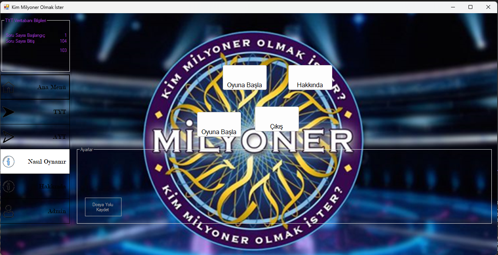
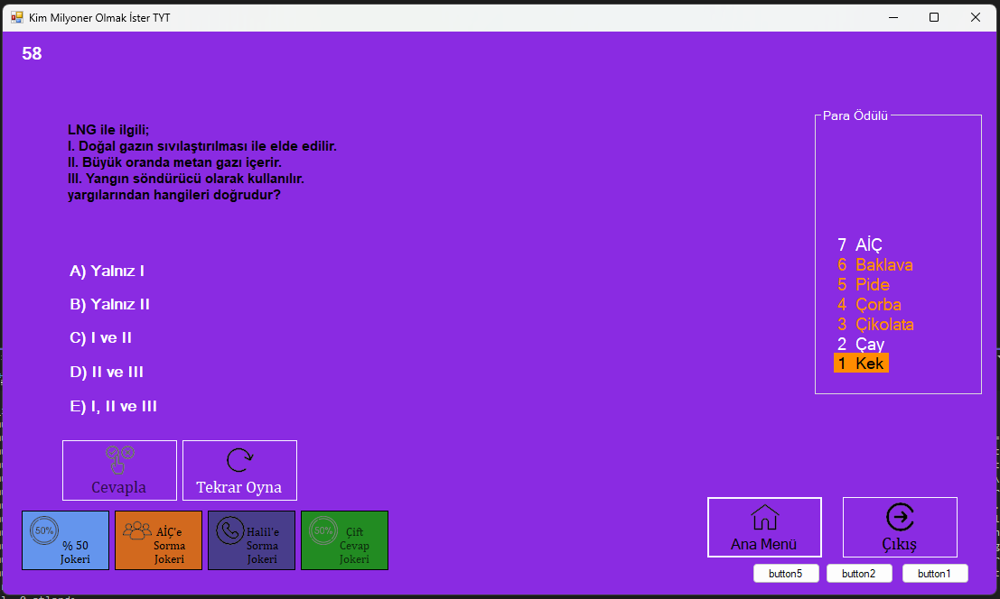
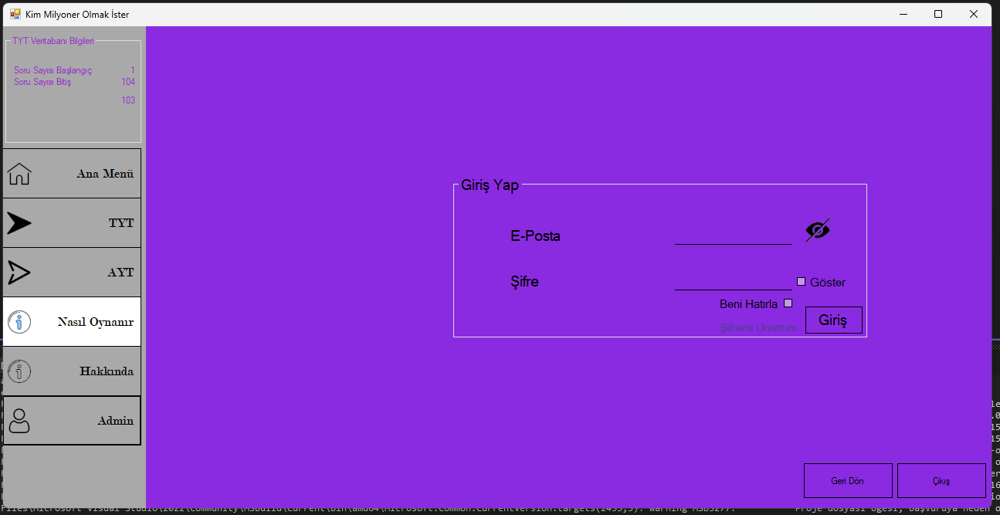

# 💰 Who Wants to Be a Millionaire? (C# WinForms)


> **📜 Dev Note:** This is a **High School Project** originally developed between **2021-2022**. The GitHub commit history was reset in January 2026 during a restoration process to fix broken DLL references (iTextSharp) and modernize the project structure for Visual Studio 2022 compatibility.

---

## 🎮 About the Project
This application is a digital adaptation of the world-famous "Who Wants to Be a Millionaire?" game show. Developed using C# and .NET Framework, this desktop application features a dynamic question management system and a database integration.

### ✨ Core Features
* **Dynamic Question System:** Questions are fetched and categorized from the database.
* **Lifelines:** Includes simulations of the "Ask the Audience," "Phone-a-Friend," and "50:50" lifelines with specific algorithms.
* **Sound & Visual Effects:** Authentic game show atmosphere with integrated sound files and UI graphics.
* **PDF Reporting:** Contestant results can be exported as a PDF report using the `iTextSharp` library.

## 🛠️ Technical Stack
* **IDE:** Microsoft Visual Studio 2022
* **Framework:** .NET Framework 4.8
* **Database:** SQLite / SQL Server LocalDB
* **Libraries:** - `iTextSharp`: For PDF generation.
  - `Microsoft.Data.Tools.Schema.Sql`: For SQL schema management.

## 📦 Setup & Installation
1. Clone the repository:
   ```bash
   git clone [https://github.com/LyeusV/kim-milyoner-olmak-ister-.git](https://github.com/LyeusV/kim-milyoner-olmak-ister-.git)
### 🎨 UI/UX Note
The interface was designed back in 2021 during high school. While it follows a retro aesthetic, it represents my early steps into UI design and event-driven programming.
## 📸 Screenshots
<p align="center">
  
  
  
</p>
